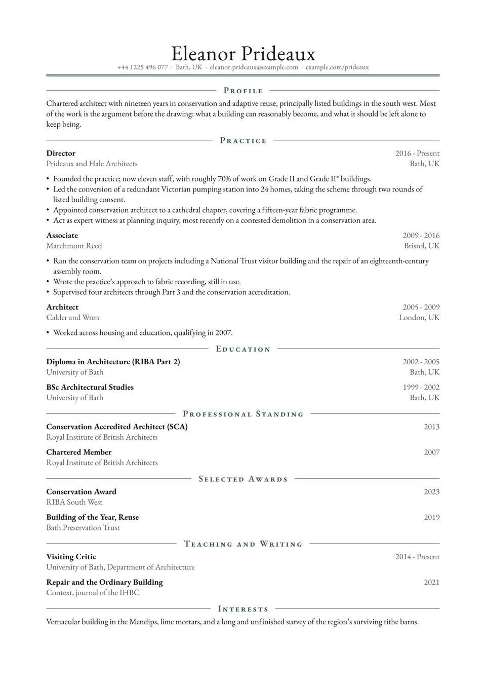

# Crest CV

The name sits large and centred over a centred contact line, closed by a double
rule. Section labels are small caps between two hairlines, also centred. It is a
letterpress convention, and it signals seriousness before anyone has read a word.

Use it where the reader expects gravity: trustee boards, chambers, professional
institutes, senior public appointments.

Crest is also the sparest thing here. It hands you a shell and a divider and
then gets out of the way, because a template that dictates the shape of an entry
will be wrong about somebody's career.

<div align="center">
  
</div>

## Getting started

**In the Typst app**, open
[the package page](https://typst.app/universe/package/crest-cv) and choose
*Create project in app*.

**On the command line:**

```sh
typst init @preview/crest-cv:0.1.0 my-cv
typst compile my-cv/main.typ
```

Crest is set in **EB Garamond**, which ships with Typst, so it compiles
identically everywhere with nothing to install.

## Using it as a package

The contact details go on the show rule; there is no separate header call.

```typ
#import "@preview/crest-cv:0.1.0": *

#let accent = "#3a5a63"

#show: resume.with(
  author: "Eleanor Prideaux",
  location: "Bath, UK",
  email: "eleanor.prideaux@example.com",
  phone: "+44 1225 496 077",
  social-links: (("example.com/prideaux", "example.com/prideaux"),),
  accent-color: accent,
)

#cv-section("Practice", accent-color: accent)
```

The package exports `resume` and `cv-section`. That is the whole API.

Each entry in `social-links` is a `(url, display text)` pair. They appear in the
order given, and a bare domain works as well as a full URL.

## Writing entries

There is no entry function, because there is no single right shape for one. The
sample defines a four-line helper in `main.typ` and uses it throughout:

```typ
#let muted = rgb("#5a5a55")
#let entry(role: "", org: "", location: "", dates: "") = grid(
  columns: (1fr, auto),
  align: (left + top, right + top),
  column-gutter: 1em,
  [#strong[#role] #linebreak() #text(fill: muted)[#org]],
  [#text(fill: muted)[#dates] #linebreak() #text(fill: muted)[#location]],
)
```

It is yours to change. Swap the columns, drop the location, put the dates under
the role instead of beside it; nothing in the package depends on it.

One thing worth knowing if you write your own: the template glues every `grid`
to whatever follows it, so an entry heading can never be stranded alone at the
foot of a page. Build entry headings as grids and you get that for free. Bullet
lists stay breakable, so a long entry still flows across a page break normally.

## Customising

| Parameter | Default | Notes |
|---|---|---|
| `accent-color` | `"#3a5a63"` | The double rule under the name and the section dividers. |
| `font` | `"EB Garamond"` | Any installed family, though the centred masthead was drawn for a serif. |
| `font-size` | `10pt` | Heading sizes are derived from this. |
| `paper` | `"a4"` | `"us-letter"` also works. |
| `margin` | `2cm` | Generous, which suits the formal register. |
| `leading` | `0.62em` | Line spacing within a paragraph. |

## License

The package source is MIT. Everything under `template/`, which is the part you
edit and publish as your own CV, is MIT-0, so nothing has to travel with it.

Maintained by [JobSprout](https://jobsprout.ai), where this design is also
available as a [hosted CV builder](https://jobsprout.ai/resume-templates/crest).
