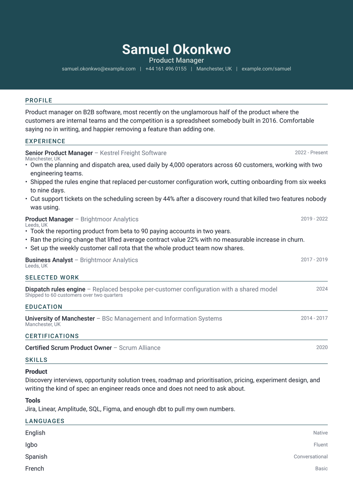

# Horizon CV

A colour band runs the full width of the page, edge to edge, with the name
reversed out of it. This is the loudest header of the set: the first thing anyone
sees is a solid block of your colour.

The band is drawn on page one only, so a two-page CV does not repeat it, and the
single column underneath does nothing to compete with it.

<div align="center">
  
</div>

## Getting started

**In the Typst app**, open
[the package page](https://typst.app/universe/package/horizon-cv) and choose
*Create project in app*.

**On the command line:**

```sh
typst init @preview/horizon-cv:0.1.0 my-cv
typst compile my-cv/main.typ
```

Horizon is set in **Roboto**, already on the Typst web app. Locally, install it
or name another family in `font`.

## The margin has to match

The band escapes the page margins to reach the paper edge, which means it has to
be told how wide that margin is. Set it once and pass the same value to both
calls:

```typ
#let page-margin = 1.5cm

#show: resume.with(author: "Samuel Okonkwo", margin: page-margin)

#horizon-header(author: "Samuel Okonkwo", margin: page-margin)
```

If the two disagree, the band either stops short of the edge or overshoots it.
Nothing else in the template cares.

## Using it as a package

```typ
#import "@preview/horizon-cv:0.1.0": *

#let accent = "#1f4a54"
#let page-margin = 1.5cm

#show: resume.with(
  author: "Samuel Okonkwo",
  font: "Roboto",
  margin: page-margin,
)

#horizon-header(
  author: "Samuel Okonkwo",
  profession: "Product Manager",
  margin: page-margin,
  accent-color: accent,
  contact: [samuel.okonkwo\@example.com #h(0.6em) | #h(0.6em) Manchester, UK],
)

#cv-section("Experience", accent-color: accent)

#horizon-entry(
  title: "Senior Product Manager",
  subtitle: "Kestrel Freight Software",
  dates: "2022 - Present",
  location: "Manchester, UK",
)[
  - Something you did, with the number that makes it land.
]
```

The package exports `resume`, `horizon-header`, `cv-section`, `horizon-entry`
and `horizon-language`.

`horizon-entry` takes `title`, `subtitle`, `dates`, `location` and `meta`, all
optional, followed by the body. Unused arguments collapse instead of
leaving a hole, which is what lets one function set a job, a degree and a
one-line project without them reading as three different things.

## Customising

| Parameter | Default | Notes |
|---|---|---|
| `accent-color` | `"#1f4a54"` | The band fill and the section labels. The name sits on the band in near-white, so pick something dark enough to carry it. |
| `margin` | `1.5cm` | Must match between `resume` and `horizon-header`. |
| `font` | `"Roboto"` | Any installed family. |
| `font-size` | `10.5pt` | The rest of the scale is derived from this. |
| `paper` | `"a4"` | `"us-letter"` also works. |

## License

The package source is MIT. Everything under `template/`, which is the part you
edit and publish as your own CV, is MIT-0, so nothing has to travel with it.

Maintained by [JobSprout](https://jobsprout.ai), where this design is also
available as a [hosted CV builder](https://jobsprout.ai/resume-templates/horizon).
