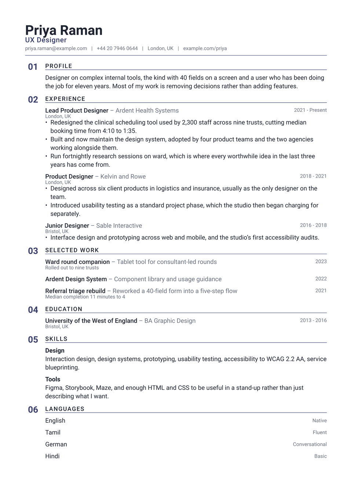

# Index CV

Sections are numbered like a contents page, 01 through however many you have,
with the figure out in the left margin and the entries indented to line up under
the label. The numbers end up forming their own column down the page. The idea
comes from Swiss editorial layout, where a number carries information and is not
there to decorate.

They count themselves in declaration order, so deleting a section renumbers what
follows. Nothing to keep in sync by hand.

<div align="center">
  
</div>

## Getting started

**In the Typst app**, open
[the package page](https://typst.app/universe/package/index-cv) and choose
*Create project in app*.

**On the command line:**

```sh
typst init @preview/index-cv:0.1.0 my-cv
typst compile my-cv/main.typ
```

Index is set in **Roboto**. The web app has it; locally, install it or change
`font`. The section numbers take whatever family you choose, set bold, so a face
with weak numerals weakens the one thing holding the page together.

## Wrap each section in `index-body`

Wrap each section's contents in `index-body`. That is what indents them past the
number gutter so they align under the label:

```typ
#cv-section("Experience", accent-color: accent)

#index-body[
  #index-entry(title: "Lead Product Designer", dates: "2021 - Present")[
    - Something you did, with the number that makes it land.
  ]
]
```

Leave `index-body` off and the entries still render, but they start under the
number instead of the label and the column of figures stops reading as a column.

## Using it as a package

```typ
#import "@preview/index-cv:0.1.0": *

#let accent = "#3a3f6b"

#show: resume.with(
  author: "Priya Raman",
  font: "Roboto",
)

#masthead(
  author: "Priya Raman",
  profession: "UX Designer",
  accent-color: accent,
  contact: [priya.raman\@example.com #h(0.6em) | #h(0.6em) London, UK],
)

#cv-section("Experience", accent-color: accent)

#index-body[
  #index-entry(
    title: "Lead Product Designer",
    subtitle: "Ardent Health Systems",
    dates: "2021 - Present",
    location: "London, UK",
  )[
    - Something you did, with the number that makes it land.
  ]
]
```

The package exports `resume`, `masthead`, `cv-section`, `index-body`,
`index-entry` and `index-language`.

`index-entry` takes `title`, `subtitle`, `dates`, `location` and `meta`, all
optional, followed by the body. Arguments you leave out take no room.
Numbering makes a thin section conspicuous, though, so group short material
rather than giving it a number of its own.

The masthead sits outside `index-body`, at full width, so the name is not
indented with everything else.

## Customising

| Parameter | Default | Notes |
|---|---|---|
| `accent-color` | `"#3a3f6b"` | The section numbers and rules. The numbers are the only place the colour appears at any size, so pick something that holds up bold. |
| `font` | `"Roboto"` | Any installed family. |
| `font-size` | `10.5pt` | The rest of the scale is derived from this. |
| `paper` | `"a4"` | `"us-letter"` also works. |
| `margin` | `1.5cm` | Applied on all four sides; the numbers sit inside it, not in it. |

## License

The package source is MIT. Everything under `template/`, which is the part you
edit and publish as your own CV, is MIT-0, so nothing has to travel with it.

Maintained by [JobSprout](https://jobsprout.ai), where this design is also
available as a [hosted CV builder](https://jobsprout.ai/resume-templates/index).
