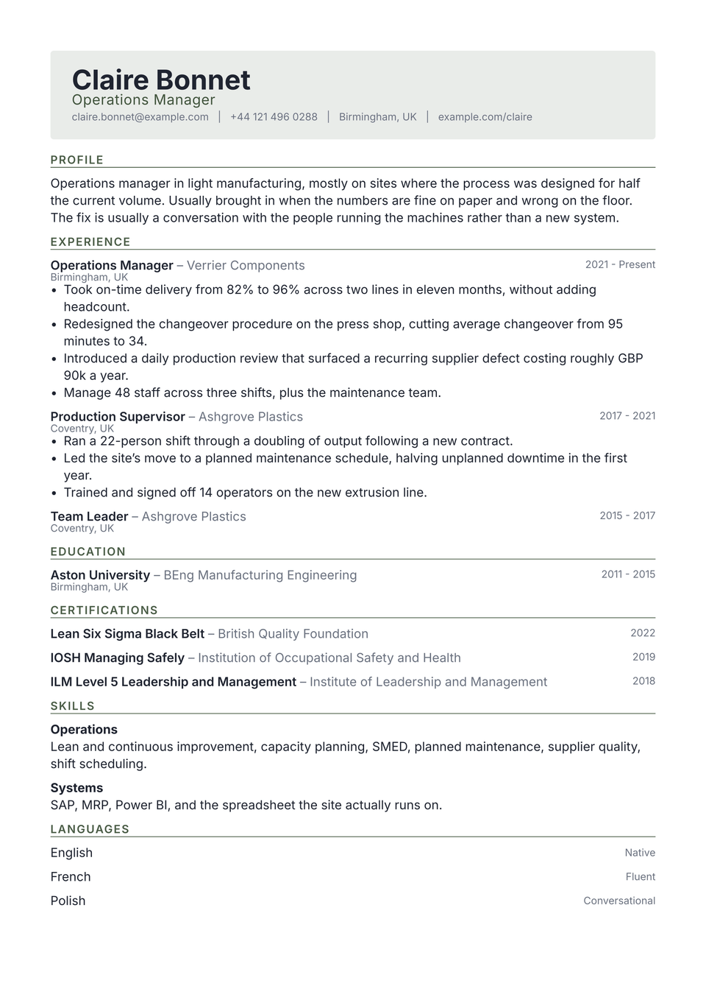

# Letterhead CV

A tinted panel behind the name, the way company stationery does it. It gives the
first screen some weight without spending a strong colour to get there, and
since the panel belongs to the header and not to the page, it appears once and
page two starts clean.

Under the panel, an ordinary single column. The tint is already doing the
work.

<div align="center">
  
</div>

## Getting started

**In the Typst app**, open
[the package page](https://typst.app/universe/package/letterhead-cv) and choose
*Create project in app*.

**On the command line:**

```sh
typst init @preview/letterhead-cv:0.1.0 my-cv
typst compile my-cv/main.typ
```

Letterhead is set in **Inter**, already present on the Typst web app. Locally,
install it or point `font` somewhere else. Nothing in the layout is tied to the
family.

## Using it as a package

```typ
#import "@preview/letterhead-cv:0.1.0": *

#let accent = "#4a5d46"

#show: resume.with(
  author: "Claire Bonnet",
  font: "Inter",
)

#masthead(
  author: "Claire Bonnet",
  profession: "Operations Manager",
  accent-color: accent,
  contact: [claire.bonnet\@example.com #h(0.6em) | #h(0.6em) Birmingham, UK],
)

#cv-section("Experience", accent-color: accent)

#letterhead-entry(
  title: "Operations Manager",
  subtitle: "Verrier Components",
  dates: "2021 - Present",
  location: "Birmingham, UK",
)[
  - Something you did, with the number that makes it land.
]
```

The package exports `resume`, `masthead`, `cv-section`, `letterhead-entry` and
`letterhead-language`.

`letterhead-entry` takes `title`, `subtitle`, `dates`, `location` and `meta`,
all optional, followed by the body. Skip any of them and nothing is held
open in its place, so a certification with a name, an issuer and a year sits as
cleanly as a role with four bullets.

## Adding a portrait

`masthead` takes an optional `photo`, set into the panel beside the name:

```typ
#masthead(
  author: "Claire Bonnet",
  photo: "portrait.jpg",
  photo-size: 2.3cm,
  photo-radius: 4pt,
)
```

`photo-radius: 50%` gives a circle. With no `photo`, the panel renders the name
and contact line alone and nothing shifts.

## Customising

| Parameter | Default | Notes |
|---|---|---|
| `accent-color` | `"#4a5d46"` | The panel tint and the section labels. The panel is a light wash of this colour, so a dark, saturated value reads best. Pass it to `masthead` and `cv-section`, as the sample does. |
| `font` | `"Inter"` | Any installed family. |
| `font-size` | `10.5pt` | The rest of the scale is derived from this. |
| `paper` | `"a4"` | `"us-letter"` also works. |
| `margin` | `1.5cm` | Applied on all four sides; the panel bleeds past it. |

## License

The package source is MIT. Everything under `template/`, which is the part you
edit and publish as your own CV, is MIT-0, so nothing has to travel with it.

Maintained by [JobSprout](https://jobsprout.ai), where this design is also
available as a [hosted CV builder](https://jobsprout.ai/resume-templates/letterhead).
