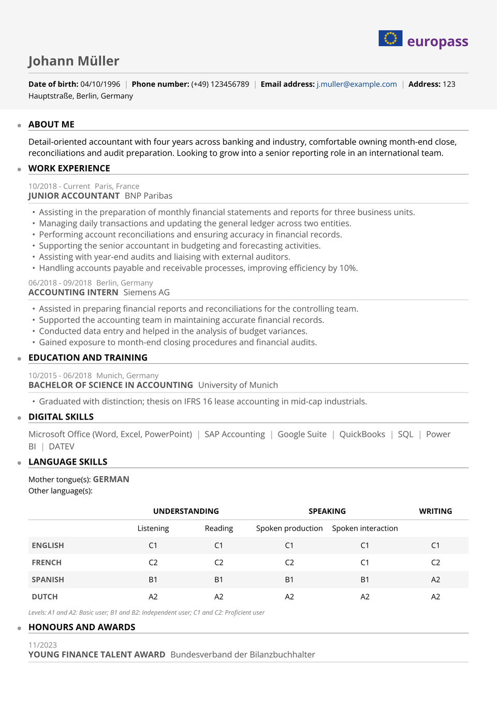

# Europass CV

The CV the official europa.eu Europass editor generates, rebuilt in Typst: the
full-bleed grey header band with the flag-and-wordmark lockup, bold-labelled
personal facts, uppercase section labels over thin rules with the signature
margin dots, and the CEFR language self-assessment grid.

Use it wherever a Europass CV is asked for or expected: applications to EU
institutions and agencies, Erasmus and scholarship programmes, and any European
employer that wants candidates on the standard comparable format. Every colour
and proportion was taken from a PDF generated by the official editor, so the
output reads as standard at a glance.

<div align="center">
  
</div>

## Getting started

**In the Typst app**, open
[the package page](https://typst.app/universe/package/europass-cv) and choose
*Create project in app*.

**On the command line:**

```sh
typst init @preview/europass-cv:0.1.0 my-cv
typst compile my-cv/main.typ
```

The official Europass PDF is set in **Open Sans**; the show rule falls back to
**Lato** (available in the Typst web app) when Open Sans is not installed, and
any sans you have works via the `font` argument.

## Using it as a package

The show rule sets the document; the header band, sections, entries, skills and
the language grid are separate calls.

```typ
#import "@preview/europass-cv:0.1.0": *

#show: resume.with(
  author: "Johann Müller",
  font: ("Open Sans", "Lato"),
  font-size: 10pt,
  paper: "a4",
  margin: 1.2cm,
)

#masthead(
  author: "Johann Müller",
  date-of-birth: [04/10/1996],
  phone: [(+49) 123456789],
  email: link("mailto:j.muller@example.com")[j.muller\@example.com],
  address: [123 Hauptstraße, Berlin, Germany],
  margin: 1.2cm,
)

#ep-section("Work experience")
#ep-entry(
  title: "Junior Accountant",
  subtitle: "BNP Paribas",
  dates: "10/2018 - Current",
  location: "Paris, France",
)[
  - Assisting in the preparation of monthly financial statements and reports.
]
```

Section labels uppercase themselves; entries set the dates-and-location line
first, then the bold title with the organisation beside it, exactly as the
official editor lays them out.

## The language grid

`#ep-languages` renders the official CEFR self-assessment table. A plain level
fills a language's whole row; per-skill levels (`listening`, `reading`,
`production`, `interaction`, `writing`) win when given, and anything unmappable
("conversational evenings") spans the row as text. Languages whose level is
"Native" move to the *Mother tongue(s)* line above the table.

```typ
#ep-languages((
  (language: [German], level: "Native"),
  (language: [English], level: "C1"),
  (language: [French], level: "C2", interaction: "C1"),
))
```

## The header band

`#masthead` draws the shaded band edge-to-edge; pass the page margin so the
bleed lines up, and `show-logo: false` to drop the flag-and-wordmark lockup
(the official editor offers the same switch). Labels localise with the document
language (`lang: "es"` gives Spanish).

## Notes

This package recreates the public Europass document layout for people who need
to submit a CV in that format. It is not affiliated with or endorsed by the
European Union; Europass is an initiative of the EU.

Maintained by [JobSprout](https://www.jobsprout.ai), where this design is also
available as a [hosted Europass CV builder](https://www.jobsprout.ai/europass-cv).
