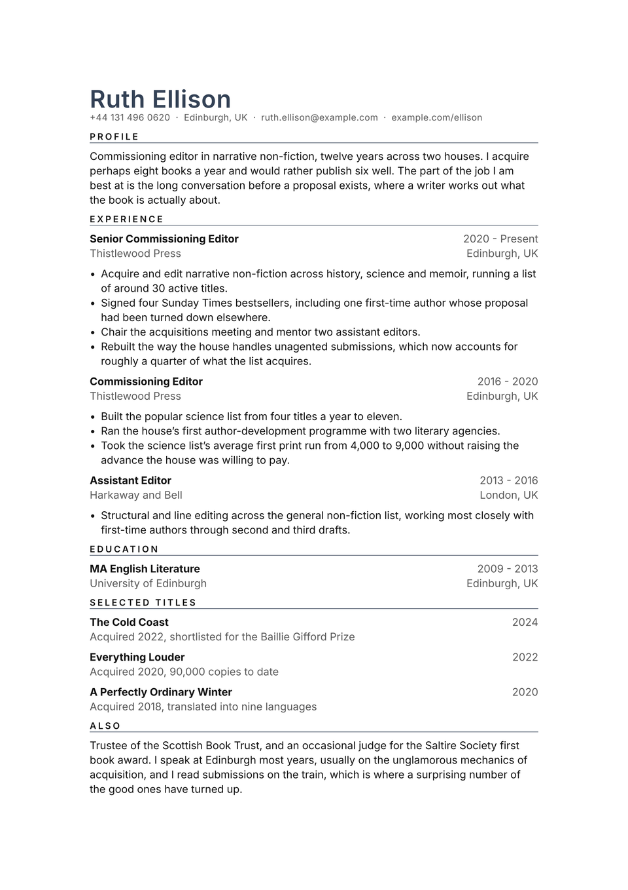

# Quietude CV

A wide margin, a small tracked label over a hairline for each section, and
nothing else at all. The white space is the design.

It suits a CV with fewer and longer entries, where you expect the thing to be
read and not scanned. Next to anything carrying panels or colour blocks it looks
conspicuously calm.

The margin defaults to 3cm, wider than a CV normally gets. Narrow it much and
you have an ordinary single column.

<div align="center">
  
</div>

## Getting started

**In the Typst app**, open
[the package page](https://typst.app/universe/package/quietude-cv) and choose
*Create project in app*.

**On the command line:**

```sh
typst init @preview/quietude-cv:0.1.0 my-cv
typst compile my-cv/main.typ
```

Quietude is set in **Inter**, which the web app has. Compiling locally without
it, change `font` rather than accepting the fallback. There is so little else on
the page that the typeface is doing most of the work.

## Using it as a package

There is no header call. The contact details are parameters on the show rule.

```typ
#import "@preview/quietude-cv:0.1.0": *

#let accent = "#334155"

#show: resume.with(
  author: "Ruth Ellison",
  location: "Edinburgh, UK",
  email: "ruth.ellison@example.com",
  phone: "+44 131 496 0620",
  social-links: (("example.com/ellison", "example.com/ellison"),),
  accent-color: accent,
  margin: 3cm,
)

#cv-section("Experience", accent-color: accent)
```

The package exports `resume` and `cv-section`. That is the whole API.

`social-links` takes `(url, display text)` pairs and renders them in the order
you give. Write the domain bare if you like; the scheme is added for you.

## Writing entries

Quietude has no entry function. At a 3cm margin the measure is narrow enough that
the right shape for a row depends on what is in it, and a function that guessed
would guess wrong often. The sample defines its own in `main.typ`:

```typ
#let muted = rgb("#5b5b5b")
#let entry(role: "", org: "", location: "", dates: "") = grid(
  columns: (1fr, auto),
  align: (left + top, right + top),
  column-gutter: 1em,
  [#strong[#role] #linebreak() #text(fill: muted)[#org]],
  [#text(fill: muted)[#dates] #linebreak() #text(fill: muted)[#location]],
)
```

Four lines, and yours to rewrite. If your job titles run long, drop the location
and give the role the whole column. If they are short, set the dates beside the
role on one line instead of stacking them.

Whatever you build, make the heading a `grid`. The template attaches every grid
to the block after it, so a heading cannot be left stranded at the foot of a page
with its bullets starting the next one. Lists stay breakable, so a genuinely long
entry still splits where it should.

## Customising

| Parameter | Default | Notes |
|---|---|---|
| `margin` | `3cm` | The design. Wider still works; much narrower defeats it. |
| `accent-color` | `"#334155"` | The name and the section hairlines. |
| `font` | `"Inter"` | Any installed family. |
| `font-size` | `10pt` | Heading sizes are derived from this. |
| `paper` | `"a4"` | `"us-letter"` also works. |
| `leading` | `0.65em` | Line spacing within a paragraph. |

## License

The package source is MIT. Everything under `template/`, which is the part you
edit and publish as your own CV, is MIT-0, so nothing has to travel with it.

Maintained by [JobSprout](https://jobsprout.ai), where this design is also
available as a [hosted CV builder](https://jobsprout.ai/resume-templates/minimal).
