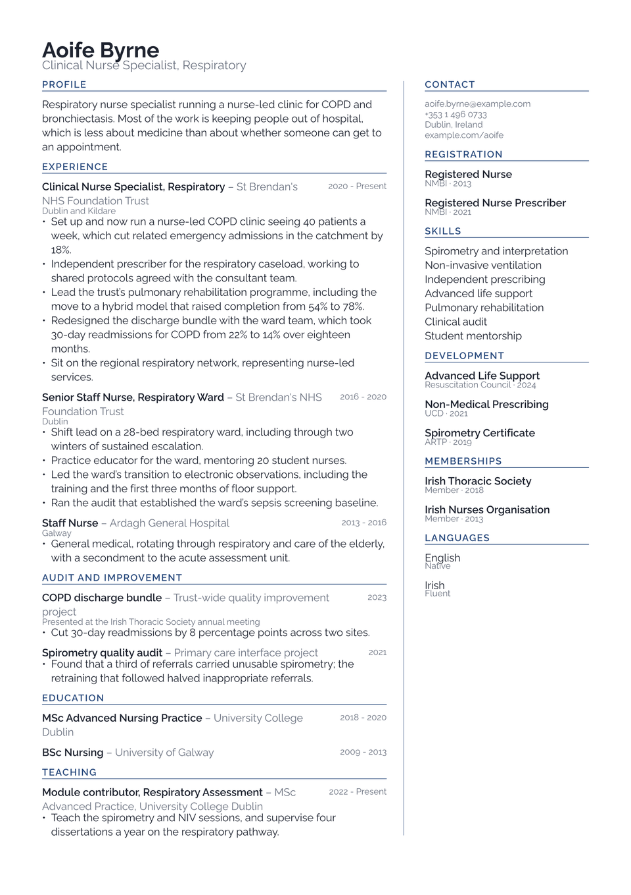

# Ridgeline CV

Career on the left in a wide column, a narrow meta rail on the right, a hairline
between them that repaints on every page. Contact details, registrations, skills
and languages live in the rail because they get scanned. The roles live in the
main column because they get read.

There is no colour block anywhere in it. The divider is a light tint of the
accent and the labels carry everything else, which keeps it usable in fields
where a coloured panel looks out of place.

<div align="center">
  
</div>

## Getting started

**In the Typst app**, open
[the package page](https://typst.app/universe/package/ridgeline-cv) and choose
*Create project in app*.

**On the command line:**

```sh
typst init @preview/ridgeline-cv:0.1.0 my-cv
typst compile my-cv/main.typ
```

Ridgeline is set in **Raleway**, which the Typst web app has. Locally, install
it or swap `font` for something else. Raleway is fairly narrow, which earns its
place in the rail; a wide family makes the credential rows wrap sooner.

## The shape of the document

The masthead spans the full width. Everything after it goes inside `cv-layout`,
which takes the two columns as named arguments:

```typ
#masthead(author: "Aoife Byrne", profession: "Clinical Nurse Specialist")

#cv-layout(
  accent-color: accent,
  main: [
    #cv-section("Experience", accent-color: accent)
    // roles, education, anything with prose
  ],
  rail: [
    #rail-contact(([aoife.byrne\@example.com], [Dublin, Ireland]))
    // registrations, skills, languages
  ],
)
```

Note that `masthead` takes no contact argument. The contact details belong in
the rail, via `rail-contact`, which draws its own "Contact" heading. Pass it an
array of content, one line each.

## Using it as a package

The package exports `resume`, `masthead`, `cv-layout`, `rail-contact`,
`cv-section`, `ridgeline-entry`, `ridgeline-cred` and `ridgeline-language`.

`ridgeline-entry` takes `title`, `subtitle`, `dates`, `location` and `meta`, all
optional, followed by the body. Blank arguments collapse rather than
holding space open. It is built for the wide column and assumes it: put it in
the rail and the title line wraps into something unreadable.

`ridgeline-cred` and `ridgeline-language` are built for the narrow one. Both
stack their second line underneath rather than setting it to the right, because
a two-column row inside a 30% rail wraps into something unreadable. Use them in
the rail and use `ridgeline-entry` in the main column.

## Customising

| Parameter | Default | Notes |
|---|---|---|
| `accent-color` | `"#2b4c7e"` | Section labels, and the divider as a light tint of it. |
| `gap` | `20pt` | Space between the two columns, on `cv-layout`. |
| `font` | `"Raleway"` | Any installed family. |
| `font-size` | `10pt` | The rest of the scale is derived from this. |
| `paper` | `"a4"` | `"us-letter"` also works. |
| `margin` | `1.4cm` | Slightly tight, to buy width for the rail. |

The rail is fixed at 30% of the measure. If your rail content is running long,
move something into the main column rather than widening it; below about a
quarter of the page the credential rows start to wrap badly.

## License

The package source is MIT. Everything under `template/`, which is the part you
edit and publish as your own CV, is MIT-0, so nothing has to travel with it.

Maintained by [JobSprout](https://jobsprout.ai), where this design is also
available as a [hosted CV builder](https://jobsprout.ai/resume-templates/margin).
