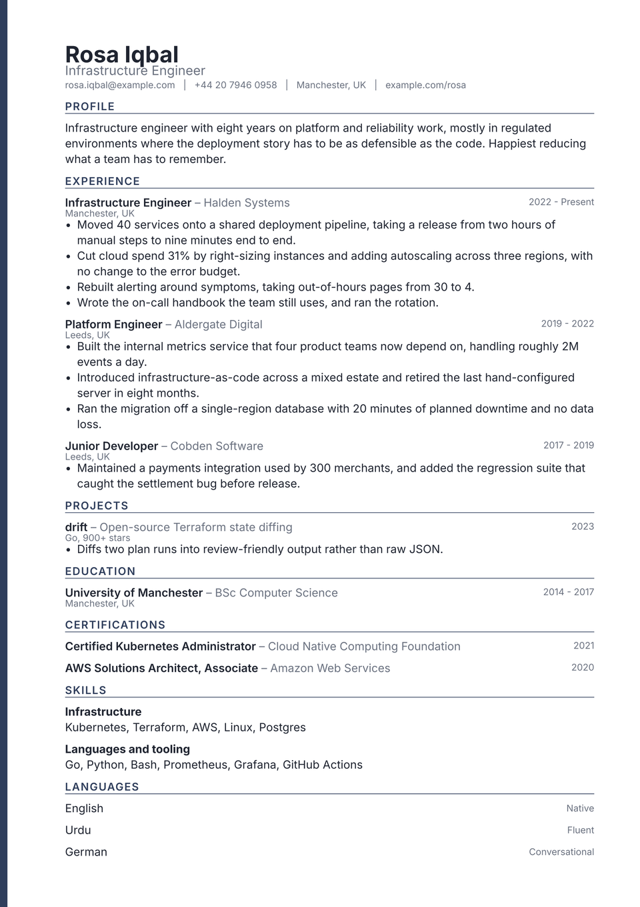

# Spine CV

A narrow band of colour down the left edge of every page. The bar is painted by
the page background and not by the content, which is why it survives onto page
two: a longer CV still reads as one document instead of two loose sheets.

Everything else stays quiet. One typeface, a fixed size scale, and the accent
used nowhere except the spine and the section labels.

It suits a CV that genuinely runs to two pages, and it prints well, since the
bar is the only ink on the sheet that is not text.

<div align="center">
  
</div>

## Getting started

**In the Typst app**, open
[the package page](https://typst.app/universe/package/spine-cv) and choose
*Create project in app*.

**On the command line:**

```sh
typst init @preview/spine-cv:0.1.0 my-cv
typst compile my-cv/main.typ
```

Spine is set in **Inter**, which the Typst web app already has. Compile locally
without it and the text falls back: the layout survives, but the spacing stops
matching the preview. Install Inter or name a family you do have.

## Using it as a package

```typ
#import "@preview/spine-cv:0.1.0": *

#let accent = "#2f3e5c"

#show: resume.with(
  author: "Rosa Iqbal",
  accent-color: accent,
  font: "Inter",
)

#masthead(
  author: "Rosa Iqbal",
  profession: "Infrastructure Engineer",
  accent-color: accent,
  contact: [rosa.iqbal\@example.com #h(0.6em) | #h(0.6em) Manchester, UK],
)

#cv-section("Experience", accent-color: accent)

#spine-entry(
  title: "Infrastructure Engineer",
  subtitle: "Halden Systems",
  dates: "2022 - Present",
  location: "Manchester, UK",
)[
  - Something you did, with the number that makes it land.
]
```

The package exports `resume`, `masthead`, `cv-section`, `spine-entry` and
`spine-language`.

`spine-entry` takes `title`, `subtitle`, `dates`, `location` and `meta`, all
optional, followed by the body. Omit whatever you do not have and the row
closes up; nothing sits in a reserved empty slot. A degree with a title and two
years sets as tightly as a job with five bullets under it.

## Customising

| Parameter | Default | Notes |
|---|---|---|
| `accent-color` | `"#2f3e5c"` | The spine and the section labels. Pass it to `masthead` and `cv-section` too, as the sample does. |
| `font` | `"Inter"` | Any installed family. |
| `font-size` | `10.5pt` | The rest of the scale is derived from this. |
| `paper` | `"a4"` | `"us-letter"` also works. |
| `margin` | `1.5cm` | The spine sits in the left margin, which widens automatically. |

## License

The package source is MIT. Everything under `template/`, which is the part you
edit and publish as your own CV, is MIT-0, so nothing has to travel with it.

Maintained by [JobSprout](https://jobsprout.ai), where this design is also
available as a [hosted CV builder](https://jobsprout.ai/resume-templates/spine).
