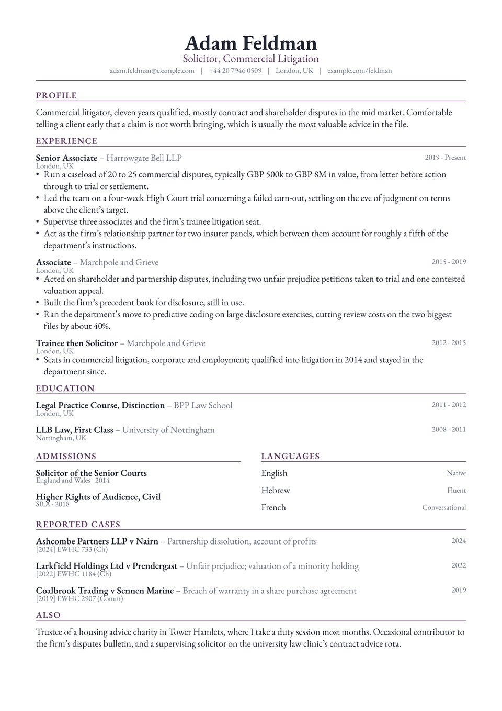

# Vertex CV

Short sections sit two-up instead of stacked. Admissions, languages, memberships
and the like are three words wide, and running each at full measure under its own
heading leaves the page looking like a list of stubs, so they pair off.

Roles and education keep the full width. The pairing is for the tail of a CV; it
is not a column layout.

<div align="center">
  
</div>

## Getting started

**In the Typst app**, open
[the package page](https://typst.app/universe/package/vertex-cv) and choose
*Create project in app*.

**On the command line:**

```sh
typst init @preview/vertex-cv:0.1.0 my-cv
typst compile my-cv/main.typ
```

Vertex is set in **EB Garamond**, which ships with Typst, so it compiles
identically everywhere with nothing to install.

## Pairing short sections

`vertex-twoup` takes two bodies and sets them as equal columns. Put the whole
section in each, heading included:

```typ
#vertex-twoup(
  [
    #cv-section("Admissions", accent-color: accent)
    #vertex-cred(name: "Solicitor of the Senior Courts", date: "2014")
  ],
  [
    #cv-section("Languages", accent-color: accent)
    #vertex-language(language: "English", level: "Native")
  ],
)
```

Use it for anything short: certifications beside languages, memberships beside
interests. Do not use it for roles, which need the measure.

## Using it as a package

```typ
#import "@preview/vertex-cv:0.1.0": *

#let accent = "#5c3a5f"

#show: resume.with(
  author: "Adam Feldman",
  font: "EB Garamond",
)

#masthead(
  author: "Adam Feldman",
  profession: "Solicitor, Commercial Litigation",
  accent-color: accent,
  contact: [adam.feldman\@example.com #h(0.6em) | #h(0.6em) London, UK],
)

#cv-section("Experience", accent-color: accent)

#vertex-entry(
  title: "Senior Associate",
  subtitle: "Harrowgate Bell LLP",
  dates: "2019 - Present",
  location: "London, UK",
)[
  - Something you did, with the number that makes it land.
]
```

The package exports `resume`, `masthead`, `cv-section`, `vertex-twoup`,
`vertex-entry`, `vertex-cred` and `vertex-language`.

`vertex-entry` takes `title`, `subtitle`, `dates`, `location` and `meta`, all
optional, followed by the body. Anything omitted takes no space at all.
Use it wherever there is a body to write; once an entry is down to a name and a
date, `vertex-cred` is the better fit.

`vertex-cred` is the compact form for a qualification: `name`, `issuer` and
`date`, with the issuer and date set small beneath. It is built narrow so it
survives inside a `vertex-twoup` column.

## Customising

| Parameter | Default | Notes |
|---|---|---|
| `accent-color` | `"#5c3a5f"` | The profession line and the section labels. |
| `font` | `"EB Garamond"` | Any installed family, though the centred masthead was drawn for a serif. |
| `font-size` | `11pt` | A point larger than the others, which suits Garamond's small eye. The rest of the scale follows it. |
| `paper` | `"a4"` | `"us-letter"` also works. |
| `margin` | `1.5cm` | Applied on all four sides. |

## License

The package source is MIT. Everything under `template/`, which is the part you
edit and publish as your own CV, is MIT-0, so nothing has to travel with it.

Maintained by [JobSprout](https://jobsprout.ai), where this design is also
available as a [hosted CV builder](https://jobsprout.ai/resume-templates/vertex).
