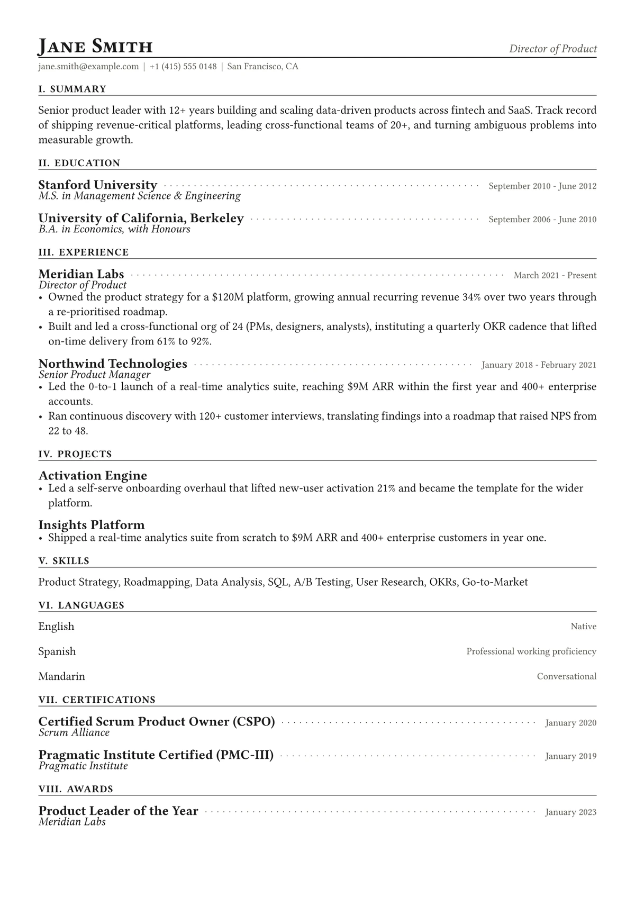

# Ledger CV

Dot leaders running organisation to date on every entry

<div align="center">
  
</div>

## Use it

`main.typ` is self-contained. Download it, or copy it into
[the Typst web app](https://typst.app), and compile:

```sh
typst compile main.typ
```

Needs Typst 0.12 or newer. Set in **Libertinus Serif**, which ships with Typst, so it renders as intended with nothing to install.

The sample fills one page and shows 8 sections (summary, experience, education, skills, certifications, awards, languages, projects),
which is the same render as the card on the hosted gallery.

## Licence

Derived from [finely-crafted-cv](https://typst.app/universe/package/finely-crafted-cv), (c) its authors, under MIT. See `NOTICE` for the modifications. That licence continues to apply to the template source; a CV you write with it is your own work.

Maintained by [JobSprout](https://www.jobsprout.ai), where this design is also available as a
[hosted builder](https://www.jobsprout.ai/resume-templates/ledger) with AI editing and ATS scoring.
