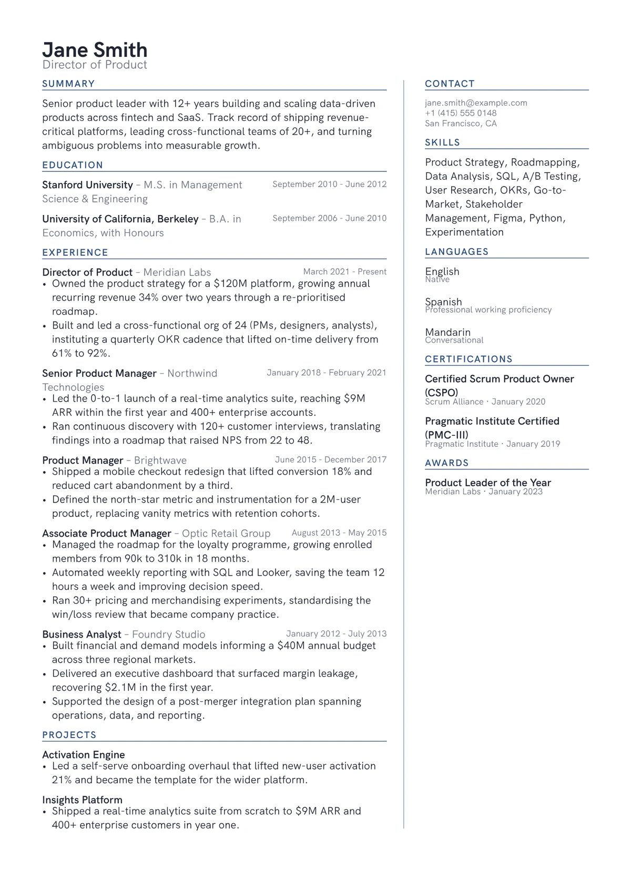

# Margin CV

An uncoloured two-column layout with the meta rail on the right

<div align="center">
  
</div>

## Use it

`main.typ` is self-contained. Download it, or copy it into
[the Typst web app](https://typst.app), and compile:

```sh
typst compile main.typ
```

Needs Typst 0.12 or newer. Set in **HK Grotesk**; if you do not have it installed, change the `font:` argument in the show rule to a family you do have.

The sample fills one page and shows 8 sections (summary, experience, education, skills, certifications, awards, languages, projects),
which is the same render as the card on the hosted gallery.

## Licence

MIT-0. Use it, change it, publish the result as your own CV. Nothing has to travel with the document you make from it.

Maintained by [JobSprout](https://www.jobsprout.ai), where this design is also available as a
[hosted builder](https://www.jobsprout.ai/resume-templates/margin) with AI editing and ATS scoring.
