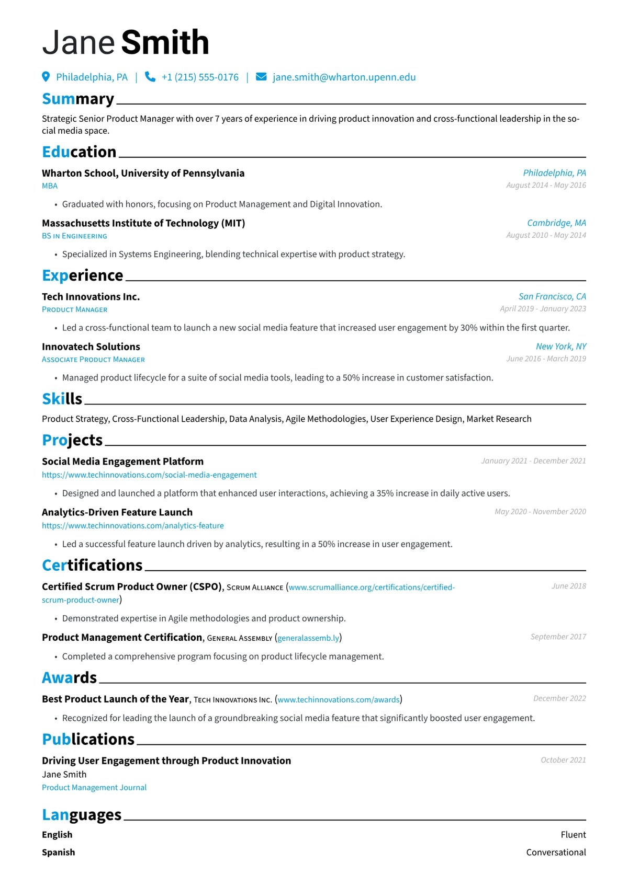

# Modern CV

Contemporary typography with clear accent hierarchy

<div align="center">
  
</div>

## Use it

`main.typ` is self-contained. Download it, or copy it into
[the Typst web app](https://typst.app), and compile:

```sh
typst compile main.typ
```

Needs Typst 0.12 or newer. Set in **Source Sans 3**; if you do not have it installed, change the `font:` argument in the show rule to a family you do have.

The sample fills one page and shows 9 sections (summary, education, experience, skills, projects, certifications, awards, publications, languages),
which is the same render as the card on the hosted gallery.

## Licence

Derived from [brilliant-CV](https://github.com/yunanwg/brilliant-CV), (c) its authors, under Apache-2.0. See `NOTICE` for the modifications. That licence continues to apply to the template source; a CV you write with it is your own work.

Maintained by [JobSprout](https://www.jobsprout.ai), where this design is also available as a
[hosted builder](https://www.jobsprout.ai/resume-templates/modern) with AI editing and ATS scoring.
